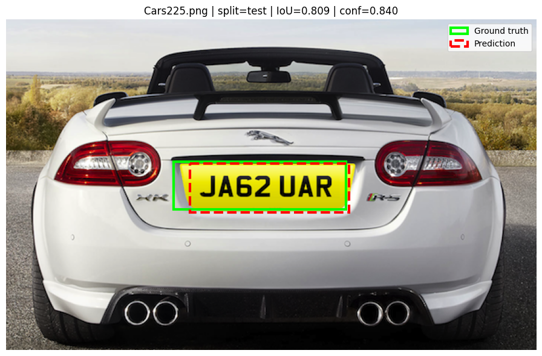
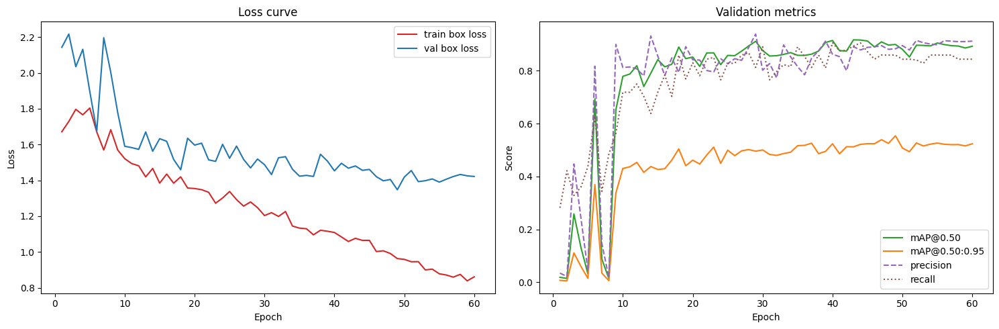
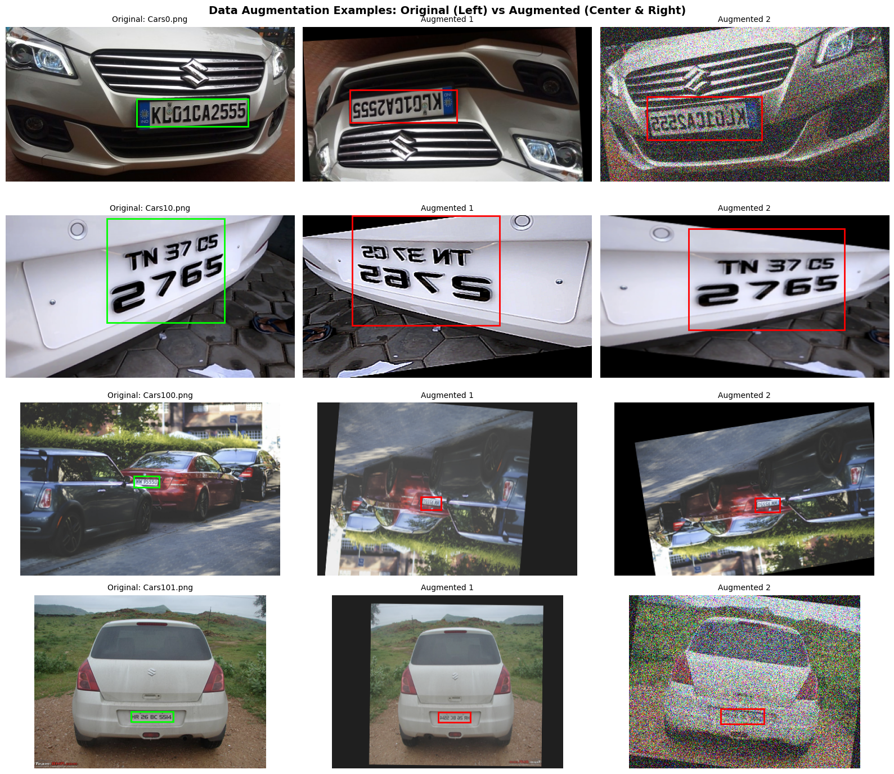
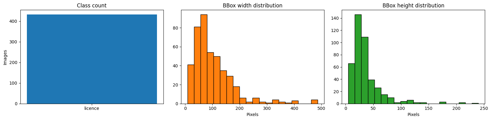
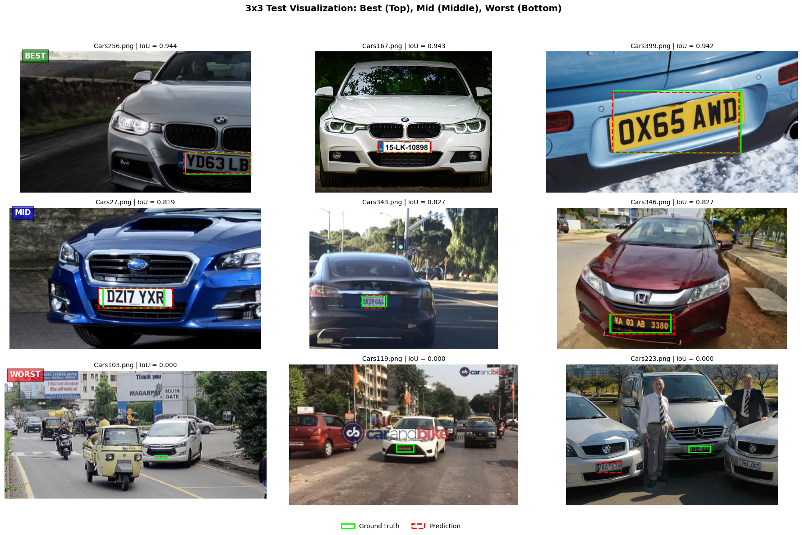

# Car License Plate Detection using YOLOv8

A deep learning project implementing single-class object detection to automatically localize license plates in vehicle images using YOLOv8s.


## Project Overview

This project develops a **single-class YOLO detector** trained to accurately localize license plates in car images. License plate detection is a critical task in intelligent transportation systems, surveillance, toll collection, and automated vehicle recognition systems.

**Key Highlights:**
- Model: **YOLOv8s** (small variant optimized for accuracy and speed)
- Evaluation Metric: **Intersection over Union (IoU)** for precise bounding box assessment
- Input Resolution: **800×800 pixels** (optimized for small-object detection)
- Dataset: Car License Plate Detection dataset from Kaggle (433 images)
- Results: **Mean IoU of 0.715** with **83.3%** of predictions exceeding IoU threshold of 0.50

---

## Problem Statement

License plate detection presents several unique challenges in computer vision:

### Why This is Challenging

1. **Small Object Problem**: License plates typically occupy only **5-7%** of the image area, making feature extraction difficult at lower resolution feature maps
   
2. **Limited Dataset**: The training dataset contains only 433 images, significantly smaller than typical deep learning benchmarks (COCO: 330k, ImageNet: 1.2M)

3. **Real-world Variability**:
   - Extreme plate size variation (10× difference from near to far)
   - Perspective distortion and camera angles
   - Lighting variations (bright sun, shadows, night scenes)
   - Watermarks and image overlays

4. **Augmentation Trade-off**: Aggressive data augmentation can distort tiny license plates beyond recognition, so careful augmentation strategies are required

### Our Solution

We tackle these challenges through:
- **Higher Input Resolution** (800×800 vs standard 640×640)
- **Conservative Augmentation** that preserves plate integrity
- **CIoU Loss** for precise localization
- **YOLOv8s** architecture optimized for edge deployment

---

## Dataset

**Dataset Source**: [Car License Plate Detection - Kaggle](https://www.kaggle.com/datasets/andrewmvd/car-plate-detection)

### Dataset Statistics

| Metric | Value |
|--------|-------|
| Total Images | 433 |
| Classes | 1 (license plate) |
| Mean Image Size | 420×316 pixels |
| Mean Plate Size | 94×24 pixels |
| Mean Plate Area Ratio | 5.7% of image |
| Annotation Format | PASCAL VOC XML |

### Train/Validation/Test Split
- **Training**: 70% (303 images)
- **Validation**: 15% (65 images)
- **Testing**: 15% (65 images)

### Dataset Visualization


*Figure 1: Sample images from the Car License Plate Detection dataset*


*Figure 2: Dataset statistics and training curves*

---

## Approach

### Model Architecture

**YOLOv8s** is a single-stage detector consisting of:

1. **Backbone**: CSPDarknet with depthwise separable convolutions for feature extraction
2. **Neck**: Path Aggregation Network (PAN) for multi-scale feature fusion
3. **Head**: Decoupled prediction heads for classification and localization

Key architectural choice: YOLOv8s selected over nano (faster but less accurate) and medium (slower) variants to balance accuracy with efficiency on limited data.

### Loss Function

The model uses a composite loss function:

$$L_{total} = L_{box} + L_{cls} + L_{obj}$$

- **Box Loss ($L_{box}$)**: Complete IoU (CIoU) - accounts for center distance, aspect ratio, and IoU
- **Classification Loss ($L_{cls}$)**: Binary cross-entropy for single-class detection
- **Objectness Loss ($L_{obj}$)**: Focal loss for handling foreground/background imbalance

### Data Augmentation Strategy

Conservative augmentation pipeline designed specifically for small objects:

| Augmentation | Probability | Purpose |
|--------------|-------------|---------|
| Horizontal Flip | 0.5 | Realistic variation |
| Vertical Flip | 0.3 | Limited (plates have consistent orientation) |
| Rotation | ±15° (p=0.5) | Avoid severe plate distortion |
| Shift/Scale | ±10% shift, ±30% scale (p=0.5) | Realistic scenes |
| Gaussian Noise | p=0.2 | Simulate camera noise |
| Brightness/Contrast | ±20% (p=0.5) | Lighting variation |
| CoarseDropout (Cutout) | p=0.2 | Regularization |

**Key Design Decision**: No mixup augmentation to preserve ground-truth bounding box integrity.


*Figure 3: Data augmentation examples preserving plate annotations*

### Training Configuration

| Parameter | Value |
|-----------|-------|
| Model | YOLOv8s |
| Epochs | 60 |
| Batch Size | 8 |
| Input Resolution | 800×800 pixels |
| Optimizer | SGD with momentum |
| Learning Rate Scheduler | Cosine annealing |
| Early Stopping Patience | 15 epochs |
| Random Seed | 42 (reproducibility) |

---

## Results

### Test Set Performance

| Metric | Value |
|--------|-------|
| **Mean IoU** | **0.715** |
| **Median IoU** | **0.823** |
| **IoU ≥ 0.50** | **83.3%** (54/65 images) |
| **IoU ≥ 0.75** | **64.6%** (42/65 images) |

### Analysis

**Strengths**:
- Strong overall localization accuracy (median IoU of 0.823)
- Most predictions (83.3%) exceed the standard 0.50 IoU threshold
- Model generalizes well to unseen test data

**Performance Breakdown**:
- **Best-case detections**: Many predictions achieve IoU > 0.90
- **Mid-range detections**: IoU 0.50-0.75 covers challenging plates
- **Worst-case detections**: Model struggles with extreme angles and lighting


*Figure 4: Distribution of IoU scores on test set*


*Figure 5: Visualization of best, mid-range, and worst-case predictions*

---


## Installation & Usage

### Prerequisites

- Python 3.8+
- GPU recommended (CUDA compatible for faster training)
- Google Colab (notebook is optimized for Colab environment)

### Quick Start

1. **Open the notebook** in Google Colab or Jupyter:
   [](https://colab.research.google.com/github/woopakyi/License-Plate-Detection/blob/main/notebook.ipynb)

2. **Install dependencies** (handled automatically in notebook):
   ```python
   pip install ultralytics kaggle torch torchvision
   ```

3. **Configure Kaggle API** (required for dataset download):
   - Obtain Kaggle API credentials from https://www.kaggle.com/settings/account
   - Set credentials in the notebook:
   ```python
   os.environ['KAGGLE_USERNAME'] = 'your_username'
   os.environ['KAGGLE_KEY'] = 'your_api_key'
   ```

4. **Run the notebook** to:
   - Download the Car License Plate Detection dataset
   - Convert PASCAL VOC annotations to YOLO format
   - Train the YOLOv8s model (60 epochs)
   - Evaluate on test set with IoU metrics
   - Generate visualizations

### Dataset Handling

The notebook automatically:
- Checks for local dataset in `archive/` folder
- Falls back to downloading from Kaggle if not found
- Splits data deterministically (seed=42) into train/val/test

---


## Discussion


### Model Limitations

- Model may struggle with extreme camera angles or severe occlusion
- Performance depends on plate visibility and contrast

### Future Improvements

- **Multi-object Detection**: Extend to detect multiple plates per image
- **Plate Recognition**: Integrate with OCR to extract plate text

---

## References

- Redmon et al., "You Only Look Once: Unified, Real-Time Object Detection" (YOLO)
- [Ultralytics YOLOv8 Documentation](https://docs.ultralytics.com/)
- [Kaggle Dataset](https://www.kaggle.com/datasets/andrewmvd/car-plate-detection)
- [Albumentations Library](https://albumentations.ai/) (data augmentation)

